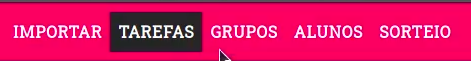

# Atividade - S01

## Objetivo da atividade
Deve-se escolher um código antigo e refatorar aplicando os conceitos 
*Tell, don`t ask* e *Fail fast*

## Sobre o código
O `codigo-antigo.js` consiste em ativar um item da navbar de acordo com a URL atual. Por exemplo, se a URL for http://localhost:3000/tarefas o item da navbar que conter o nome Tarefas será ativo. Como na imagem abaixo:

## Veja o vídeo explicando o código 

