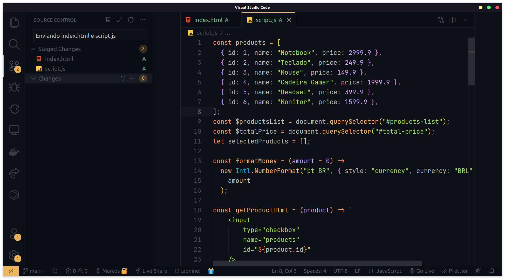
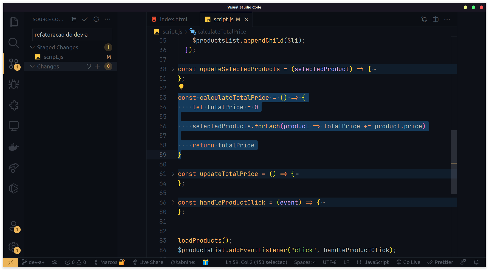
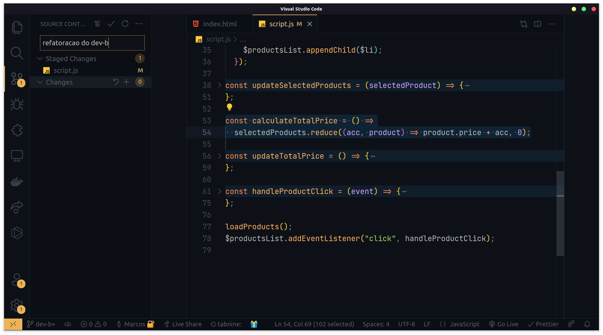
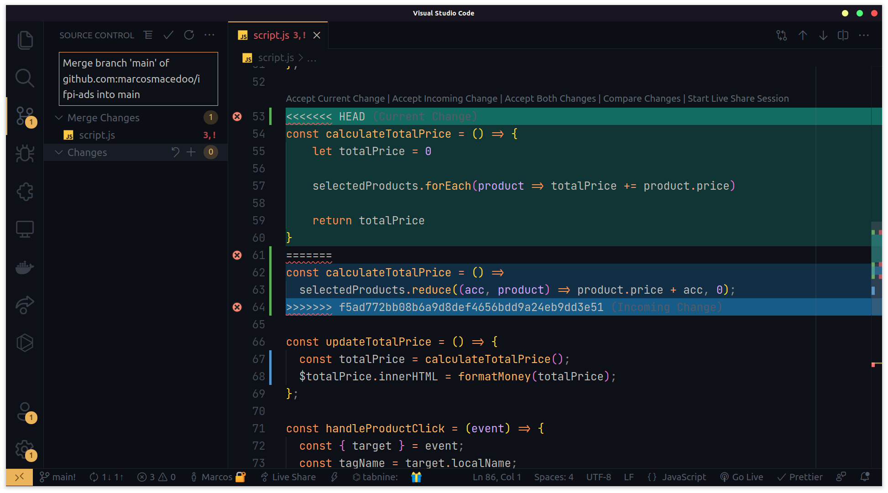
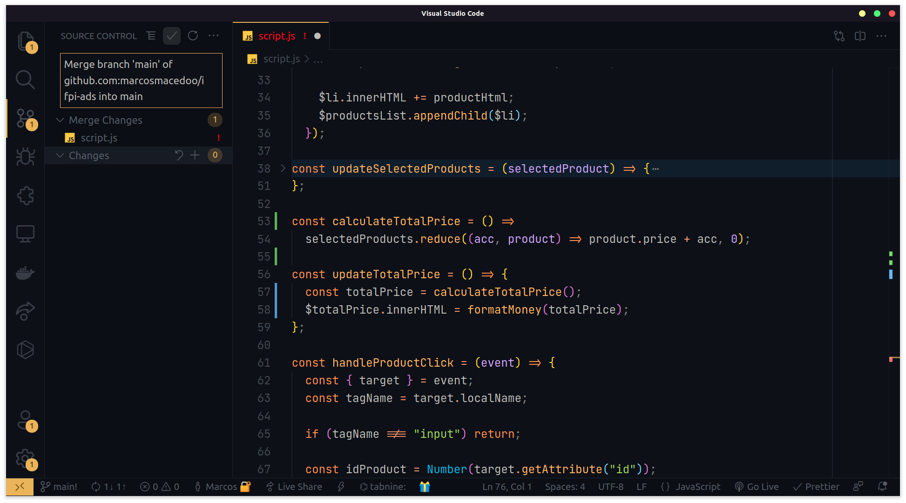

# Atividade #03

Vamos criar uma situação onde temos uma pequena aplicação web que calcula o preço total de uma lista de produtos. 

Dado um arquivo `index.html`

```html
<!DOCTYPE html>
<html lang="pt-br">
<head>
    <meta charset="UTF-8">
    <meta http-equiv="X-UA-Compatible" content="IE=edge">
    <meta name="viewport" content="width=device-width, initial-scale=1.0">
    <title>Atividade 03</title>
</head>
<body>
    <section>
        <h2>Produtos</h2>
        <ul id="products-list"></ul>
        <h3 id="total-price"></h3>
    </section>

    <script src="./script.js"></script>
</body>
</html>
```

E um arquivo `script.js`

```jsx
const products = [
  { id: 1, name: "Notebook", price: 2999.9 },
  { id: 2, name: "Teclado", price: 249.9 },
  { id: 3, name: "Mouse", price: 149.9 },
  { id: 4, name: "Cadeira Gamer", price: 1999.9 },
  { id: 5, name: "Headset", price: 399.9 },
  { id: 6, name: "Monitor", price: 1599.9 },
];
const $productsList = document.querySelector("#products-list");
const $totalPrice = document.querySelector("#total-price");
let selectedProducts = [];

const formatMoney = (amount = 0) =>
  new Intl.NumberFormat("pt-BR", { style: "currency", currency: "BRL" }).format(
    amount
  );

const getProductHtml = (product) => `
    <input 
        type="checkbox" 
        name="products" 
        id="${product.id}" 
    />
    <label for="${product.id}">
        ${product.name} - ${formatMoney(product.price)}
    </label>
`;

const loadProducts = () =>
  products.forEach((product) => {
    const $li = document.createElement("li");
    const productHtml = getProductHtml(product);

    $li.innerHTML += productHtml;
    $productsList.appendChild($li);
  });

const updateSelectedProducts = (selectedProduct) => {
  const isProductInSelectedProducts = selectedProducts.some(
    (product) => product.id === selectedProduct.id
  );

  if (!isProductInSelectedProducts) {
    selectedProducts = [...selectedProducts, selectedProduct];
    return;
  }

  selectedProducts = selectedProducts.filter(
    (product) => product.id !== selectedProduct.id
  );
};

const calculateTotalPrice = () => {
    let totalPrice = 0

    for (let i = 0; i < selectedProducts.length; i++) {
        const product = selectedProducts[i];
        totalPrice += product.price
    }

    return totalPrice
}

const updateTotalPrice = () => {
    const totalPrice = calculateTotalPrice()
    $totalPrice.innerHTML = formatMoney(totalPrice)
};

const handleProductClick = (event) => {
  const { target } = event;
  const tagName = target.localName;

  if (tagName !== "input") return;

  const idProduct = Number(target.getAttribute("id"));

  const [selectedProduct] = products.filter(
    (product) => product.id === idProduct
  );

  updateSelectedProducts(selectedProduct);
  updateTotalPrice();
};

loadProducts();
$productsList.addEventListener("click", handleProductClick);
```

Com o repositório git iniciado na branch `main`, através do VS Code, vamos adicionar a área de staged os arquivos `index.html`e o `script.js` e realizar um commit.



Agora iremos criar uma dinâmica com dois devs, cada dev terá que criar uma nova branch a partir da branch `main` e refatorar a função `calculateTotalPrice()` . Ao final, a equipe de devs terá que escolher qual dev fez a melhor refatoração e unir a branch do dev a branch `main` .

O **dev A**, esqueceu de criar sua branch e fez a sua refatoração na branch `main` 

Refatoração

```jsx
const calculateTotalPrice = () => {
    let totalPrice = 0

    selectedProducts.forEach(product => totalPrice += product.price)

    return totalPrice
}
```

Commit



Já o **dev B**, criou sua branch `dev-b`, fez sua refatoração

Refatoração

```jsx
const calculateTotalPrice = () =>
  selectedProducts.reduce((acc, product) => product.price + acc, 0);
```

Commit



E por decisão da equipe de devs, o **dev B** apresentou a melhor refatoração. Agora vamos fazer o merge entre branch `dev-b` com a `main` . No entanto, ao realizar o merge ocorreu conflitos, pois o **dev A** tinha feito a sua refatoração no branch `main`. 



Então foi escolhida a opção “Accept Incoming Change” - que é o código feito pelo **dev B.** E realizado o commit para resolver o conflito.

